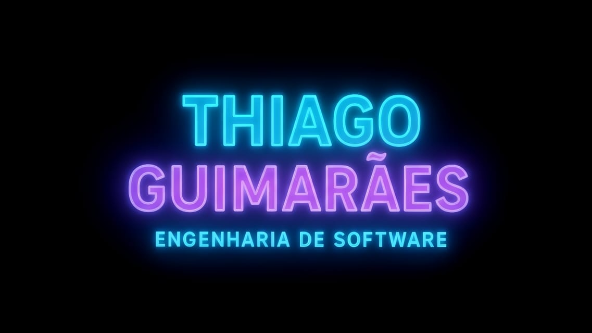
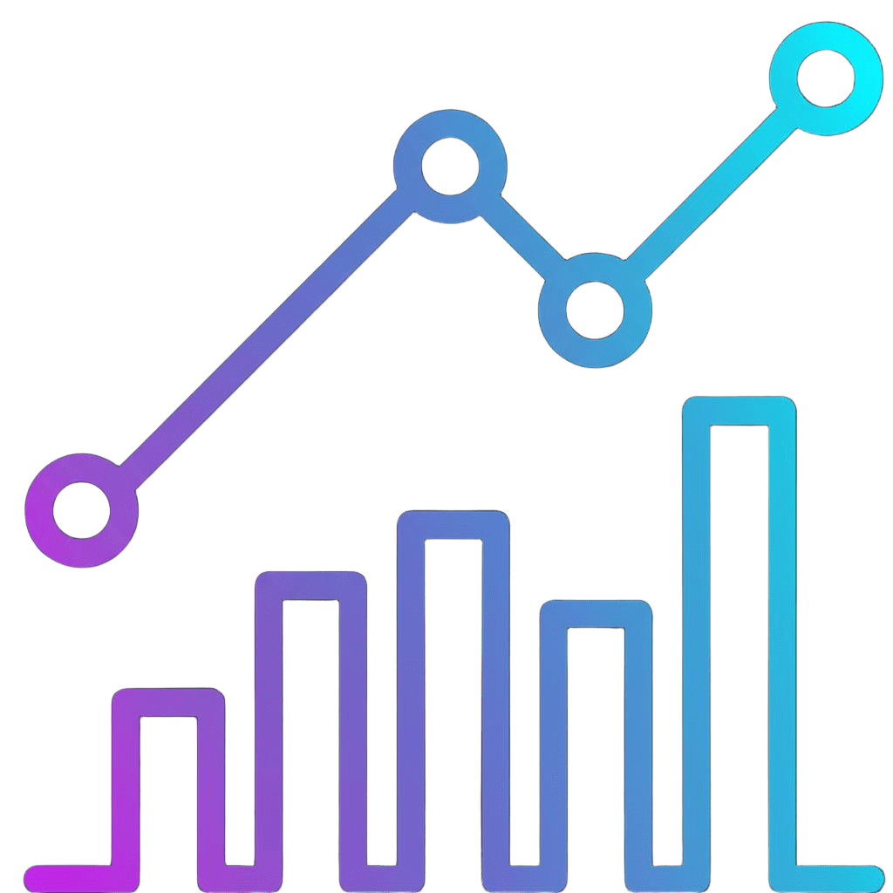

<!-- Banner -->

  

<!-- Nome -->
<h1 align="center" style="color:#00ffff; text-shadow:0 0 10px #00ffff, 0 0 20px #9b5eff;">InPsyck</h1>

  

---

<h2 align="center" style="color:#00ffff;">Sobre Mim</h2>

  

  Sou estudante de <b>Engenharia de Software (2º período)</b> 
  Atualmente desenvolvo com <b>Python, HTML e CSS</b>

---

<h2 align="center" style="color:#00ffff;">Linguagens e Tecnologias</h2>

   
  🐍 Python – automação, lógica e pequenos sistemas 
  🌐 HTML – estrutura de sites interativos 
  🎨 CSS – estilização avançada

---

<h2 align="center" style="color:#00ffff;">Projetos</h2>

   
  Aqui compartilho projetos criados dentro ou fora da faculdade, explorando novas linguagens, conceitos e frameworks.

---

<h2 align="center" style="color:#00ffff;">Estatísticas</h2>

    
  

---

<h2 align="center" style="color:#00ffff;">Contatos</h2>

  
  

