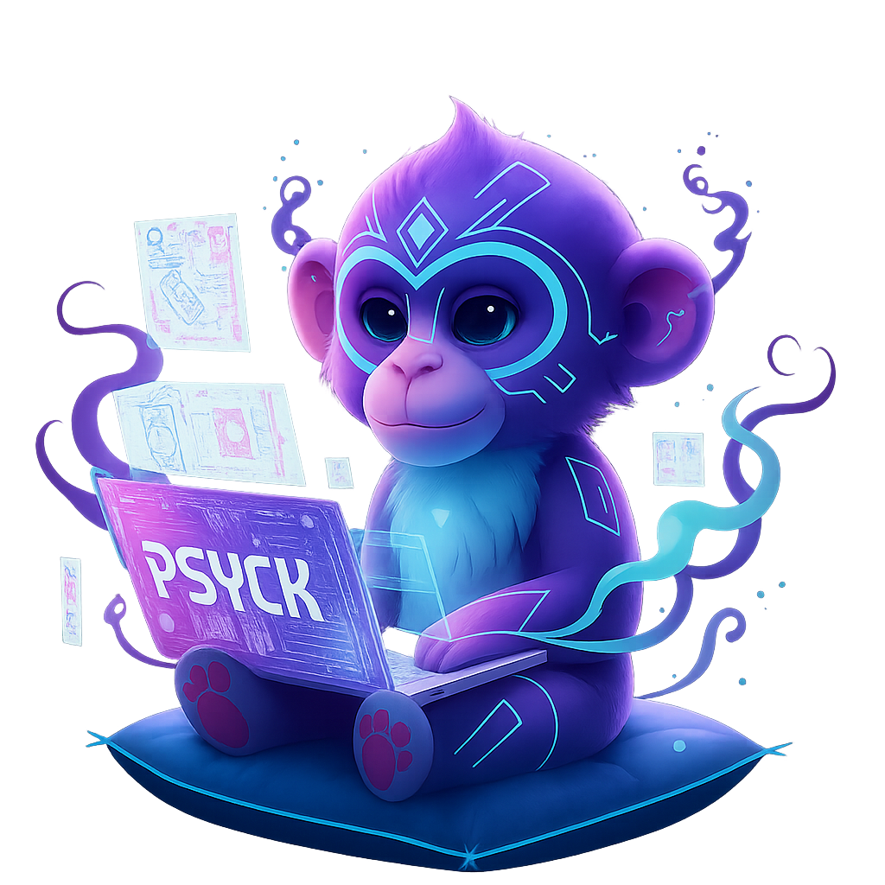
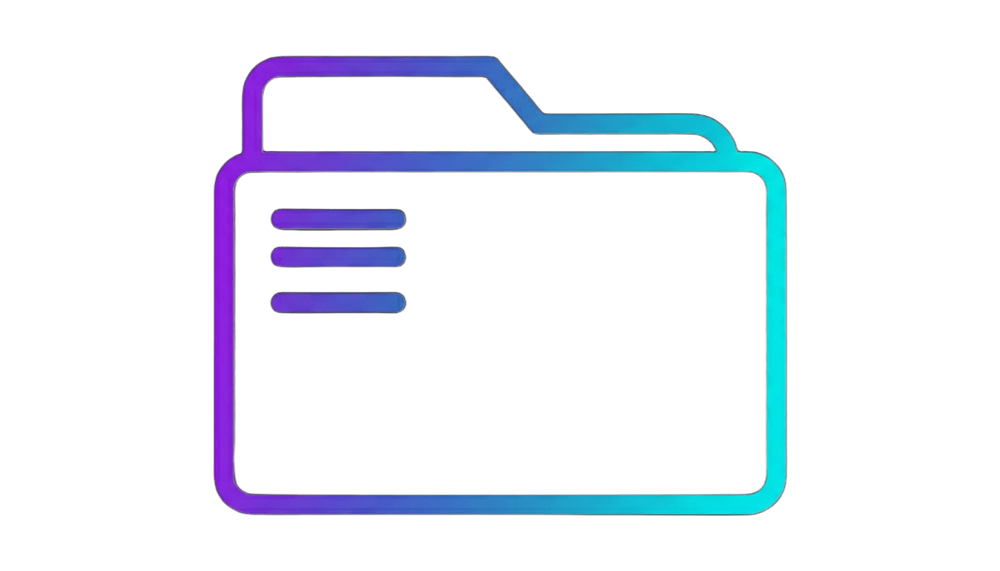

  

<!-- BANNER + MASCOTE -->

  
  

<!-- SOBRE MIM & LINGUAGENS -->>
<h1 align="center" style="color:#00ffff; text-shadow:0 0 10px #00ffff, 0 0 25px #9b5eff; margin:10px 0 5px;">InPsyck</h1>

<table align="center" width="90%" style="border-collapse:collapse; table-layout:fixed; margin-top:0;">
  <tr>
<!-- SOBRE MIM -->
    <td align="center" width="50%" valign="top" style="padding:10px 25px; border-right:2px solid #2b2b2b;">
      <h2 style="color:#ffffff; margin:0;">Sobre Mim</h2>
      

      
      

        Sou estudante de <b>Engenharia de Software (2º período)</b>. 
        Criando, aprendendo e evoluindo. 
        Atualmente desenvolvo com: <b>Python, HTML e CSS</b>.
      

      <h2 align="center" style="color:#ffffff; margin:10px 0;">Contatos</h2>

  
  
  

    </td>
 <!-- LINGUAGENS -->
    <td align="center" width="50%" valign="top" style="padding:10px 25px;">
      <h2 style="color:#ffffff; margin:0;">Linguagens e Tecnologias</h2>
      

      

   <table align="center" cellpadding="4" cellspacing="0">
        <tr>
          <td align="center"></td>
          <td align="left" style="color:#d1d1d1; font-size:15px;"><b>Python</b> – automação, lógica e pequenos sistemas</td>
        </tr>
        <tr>
          <td align="center"></td>
          <td align="left" style="color:#d1d1d1; font-size:15px;"><b>HTML</b> – estrutura de sites interativos</td>
        </tr>
        <tr>
          <td align="center"></td>
          <td align="left" style="color:#d1d1d1; font-size:15px;"><b>CSS</b> – estilização avançada</td>
        </tr>
      </table>
    </td>
  </tr>
</table>

<!-- ESTATÍSTICAS -->
<h2 align="center" style="color:#ffffff; margin:20px 0 5px;">Estatísticas</h2>
<table align="center" width="90%" style="margin-top:0;">
  <tr>
    <td align="center" width="50%">
      
    </td>
    <td align="center" width="50%">
      
    </td>
  </tr>
</table>

<!-- PROJETOS -->
<h2 align="center" style="color:#ffffff; margin:10px 0;">Projetos</h2>

   
  <ul align="center" style="color:#d1d1d1; font-size:15px; list-style:none; padding:0; margin:0;">
    <li>🎮 <a href="https://github.com/InPsyck/rpg-game" style="color:#9b5eff; text-decoration:none;">Eldoria</a> — jogo rpg simples em Python</li>
  </ul>

